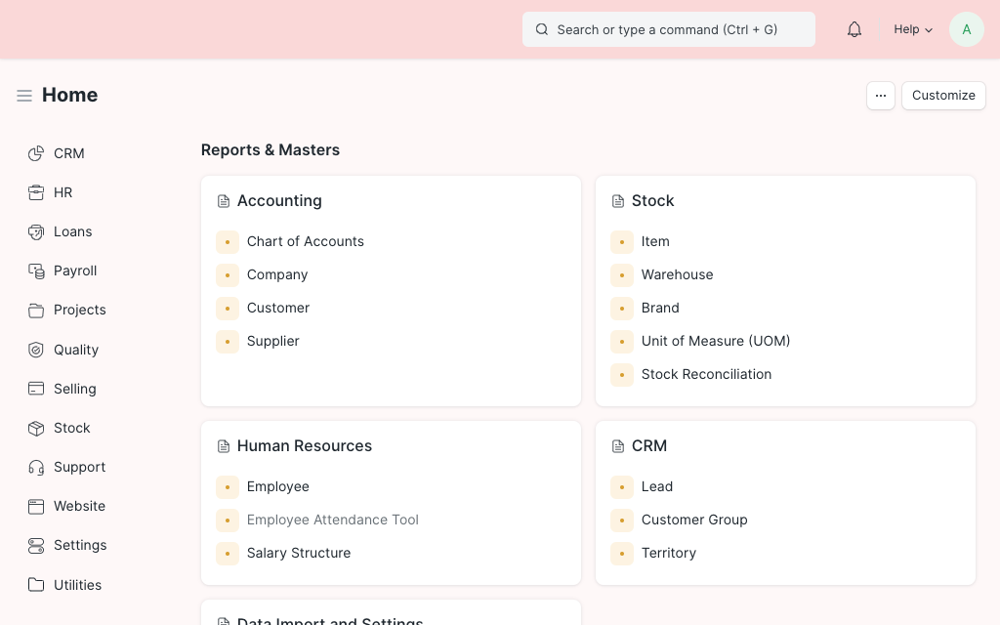

## Red Background

Adds a light red background to your [Frappe Framework](https://frappeframework.com/) or [ERPNext](https://erpnext.com/) site, in order to distinguish test from production systems.



### Install

- On [Frappe Cloud](https://frappecloud.com/marketplace/apps/red_background)

- Via [bench](https://github.com/frappe/bench)

    ```bash
    bench get-app https://github.com/alyf-de/red_background.git
    bench --site $MY_SITE install-app red_background
    ```
