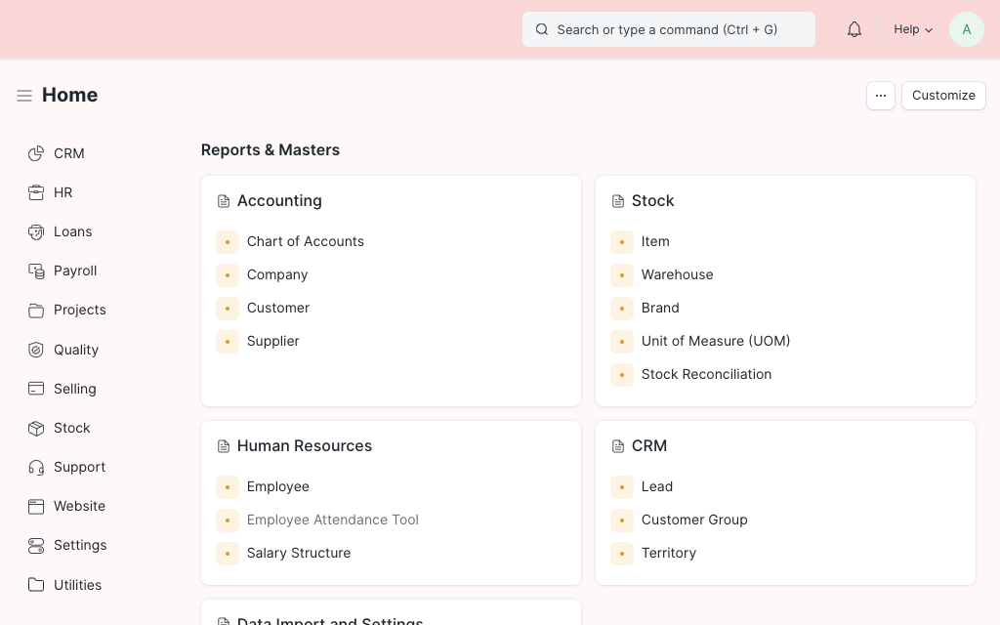

## Red Background

Adds a configurable light Desk background tint to distinguish test from production systems.



### Install

- On [Frappe Cloud](https://frappecloud.com/marketplace/apps/red_background)

- Via [bench](https://github.com/frappe/bench)

    ```bash
    bench get-app https://github.com/alyf-de/red_background.git
    bench --site $MY_SITE install-app red_background
    ```

### Operator documentation

Compendium pages (English and German) live under `red_background/docs/`:

- English: `/app/docs/en/red-background`
- German: `/app/docs/de/red-background`

Requires the [Compendium](https://github.com/alyf-de/compendium) app on the site.

Topics: site-wide presets on **Desk Background Settings**, optional personal *Desk Colour* on **User**, twenty accessibility-checked presets, backwards-compatible upgrade from the legacy **Light Red** default.
